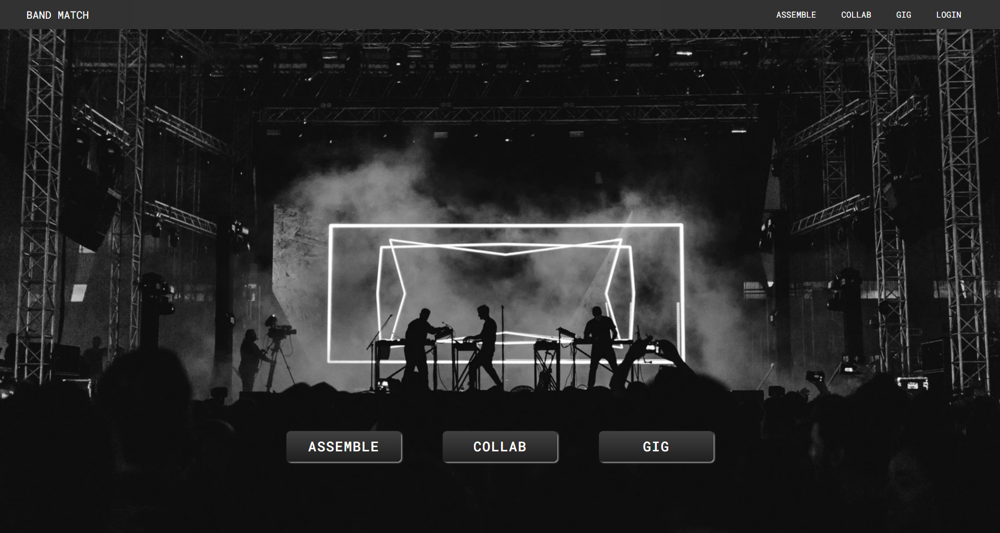
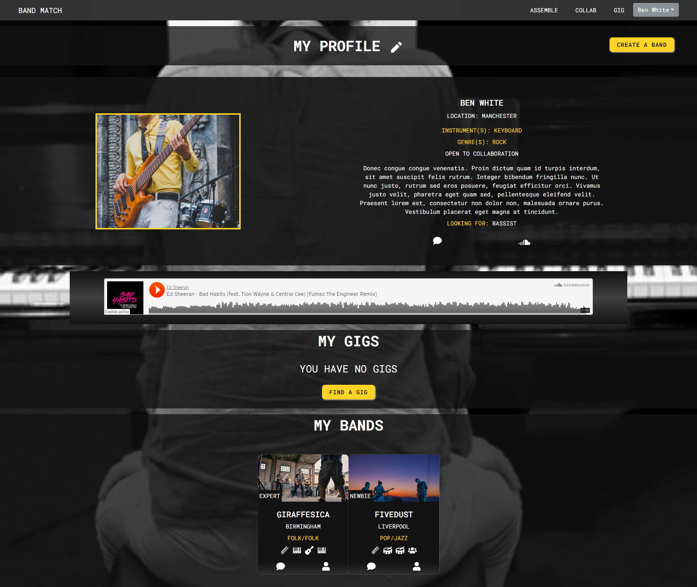
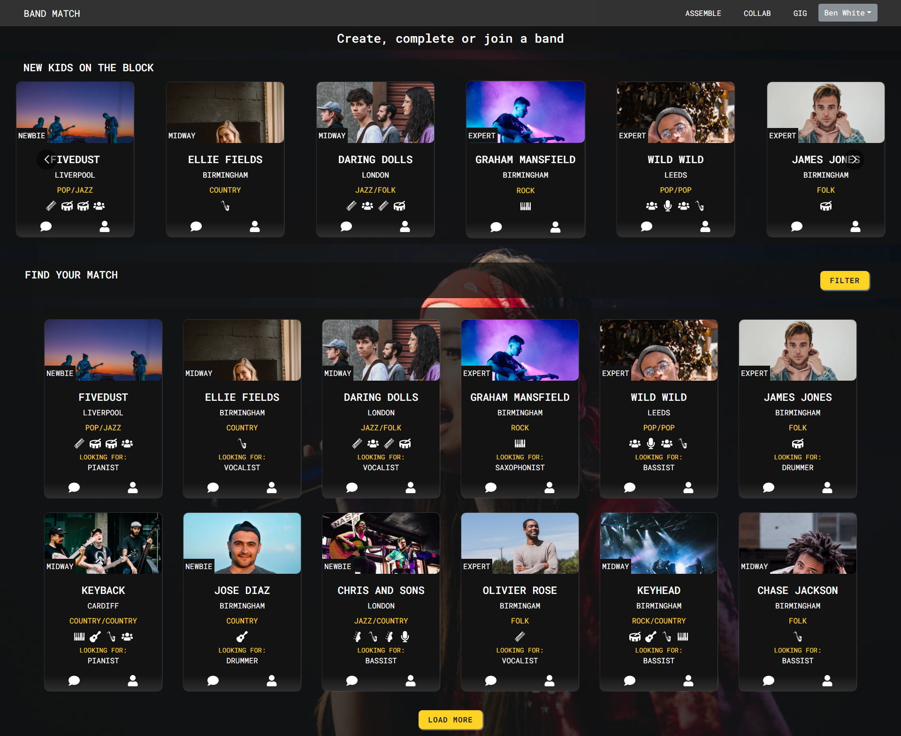
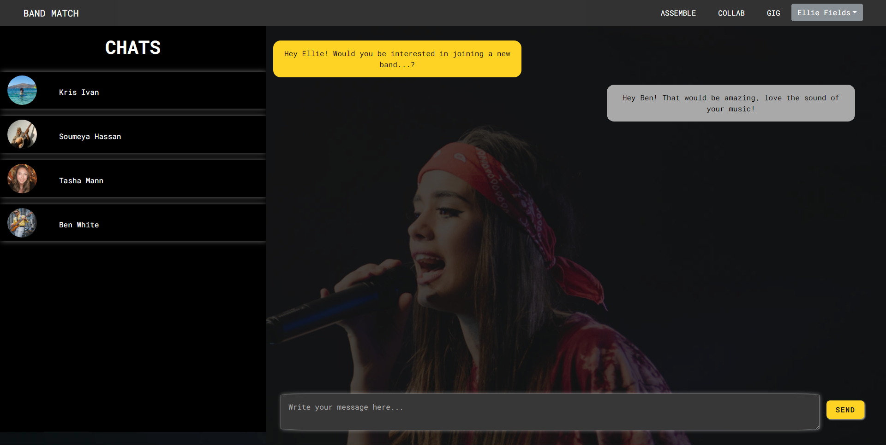

<h1>BandMatch</h1>

<h2> Introduction </h2>

The Bandmatch app gives musicians, bands and venue owners a one stop shop so they can focus on creating and showcasing amazing music.

Bandmatch gives all music creators, from budding musicians, to experienced rockstars the opportunity to create their own profile to increase exposure, the ability create bands with friends or other users, to collaborate with other bands on musicians to create the perfect sound and then to showcase it all by booking an upcoming gig posted by our venue owners.

Keep reading to find out more about our application.

<h2> Table of Contents </h2>

- [Project Link](#project-link)
- [Getting Started](#getting-started)
  - [Installation](#installation)
  - [Launch the app](#launch-the-app)
- [About the Project](#about-the-project)
  - [Description](#description)
  - [Key Features](#key-features)
  - [Technologies Used](#technologies-used)
  - [User Stories](#user-stories)
    - [Musician User](#musician-user)
    - [Venue Owner User](#venue-owner-user)
  - [Figma](#figma)
- [Screenshots](#screenshots)
  - [Future Improvements](#future-improvements)
    - [Service Provider User:](#service-provider-user)
    - [Payment](#payment)
    - [Update Chat](#update-chat)
  - [Screenshots](#screenshots-1)
- [Contact the Team](#contact-the-team)

## Project Link

To view the project on Heroku [click here](https://bandmatch-app.herokuapp.com/).

## Getting Started

To run the application locally you will first need to clone both the client and server repositories.

To access the server repository [click here](https://github.com/ivnkris/bandmatch-server) and follow the steps to get started with the server.

### Installation

```
git clone git@github.com:ivnkris/bandmatch-client.git
cd bandmatch-client
npm i
```

You will also need to add your .env following the variables in the .env.EXAMPLE file.

to do add example .env file.

### Launch the app

```
npm run start
```

## About the Project

### Description

BandMatch is a React.js application, using GraphQL queries and mutations to connect with our Apollo server and MongoDB database.

The core concept of the app is to allow users to find other musicians to either join their band or arrange collaborations with, and also to book gigs to play at.

Venues can also make use of our application to advertise upcoming gigs to musicians and to source the top talent to play at their gigs.

### Key Features

- **Messaging** - we implemented the built in polling feature on our GraphQL queries to enable almost real-time messaging within our inbox. Chats and messages are pulled in from the database every 500ms.
- **Filtering** - we made use of the dynamically created GraphQL queries on the client side to allow us to send through a range of different filtering options. These filter options are then handled in one resolver which sends back different data depending on what has been requested.
- **Global state** - we wrapped our app in two providers, one to store our user context and allow us to control the features available to logged in and non-logged in users, and another to manage all of our modals for a smoother state management.
- **AWS Integration** - user images are all hosted on AWS. This allows users the opportunity to upload personal images, without making our database very heavy.

### Technologies Used

- React.js
- Apollo Client and Server
- GraphQL
- MongoDB

Other technologies and packages:

- react-bootstrap
- react hook forms
- moment
- uuid
- JWT
- bcrypt

### User Stories

#### Musician User

```
As a musician user I can create a profile setting my experience level, played instruments and genre. I can also specify if I'm open to join a band or collaborate with other musicians.

As a musician user, I can see other musicians who would like to "Assemble" a band, I can filter based on my preferences, view their profile, listen to some of their work and message them to learn more about them.

As a musician user, I can see other musicians who are open to "Collaborate", so that if I have a specific musical idea I can find the right people to make it happen.

As a musician user, I can create a band, specifying the instrument we are looking for to complete the band and show all the members already in the band.

As a musician user, I can see upcoming "Gigs" in nearby venues and can apply to play at them.
```

#### Venue Owner User

```
As a venue owner, I can create a venue account with some information about my venue and I can see the musicians, bands and gigs on the website.

As a venue user, I can create a gig and add some information, including date, time, genre and remuneration for musicians. Musicians and bands can then apply to play at my gigs and I can approve or reject them.
```

### Figma

We used Figma as it allowed us to plan and collaborate on our designs together in real time to produce high fidelity designs. That allowed us to easily spot what we wanted to make into react components and to keep consistent designs throughout the site.

## Screenshots


### Future Improvements

#### Service Provider User:

To be a one stop shop for musicians we would like to add more services that musicians and bands may need. One such feature that we had to cut was service providers who could allow musicians to rent all they could need to create the next great hit from equipment to studio spaces.

#### Payment

To improve user experience we could add the ability for venue owners to be able to pay musicians for gigs they play on our site.

#### Update Chat

Currently our application is using graphQL polling to mimic real time conversations. To improve scalability and to add realtime notifications.

### Screenshots






## Contact the Team

- Dominika: [Github](https://github.com/dominikacookies),
  [LinkedIn](https://www.linkedin.com/in/dominika-pietrzak-183755137/)
- Kris: [Github](https://github.com/ivnkris), [LinkedIn](https://www.linkedin.com/in/krisztian-ivan-10880478//)
- Natasha: [Github](https://github.com/natasha-mann), [LinkedIn](https://www.linkedin.com/in/natashamann2896//)
- Soumeya: [Github](https://github.com/SoumeyaH), [LinkedIn](https://www.linkedin.com/in/soumeya-hassan-0a12a5203/)
